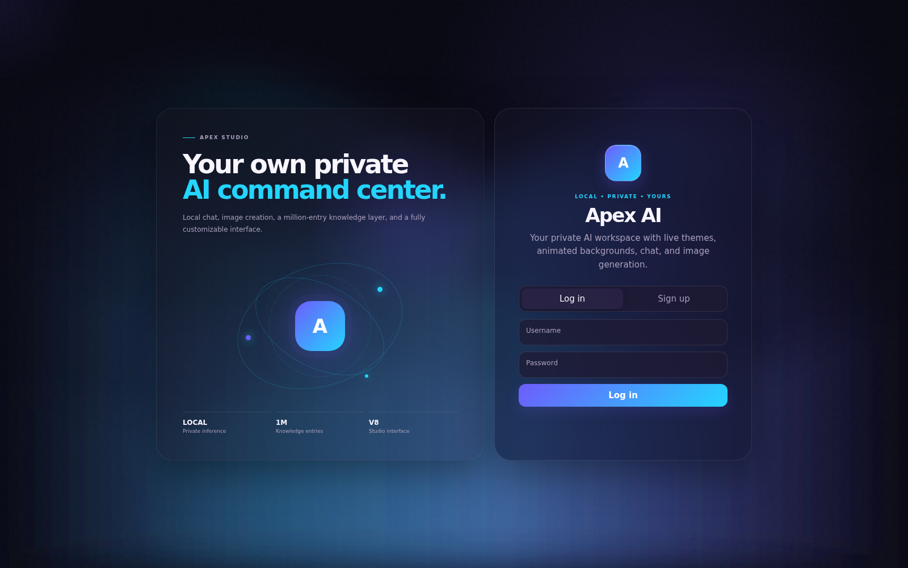
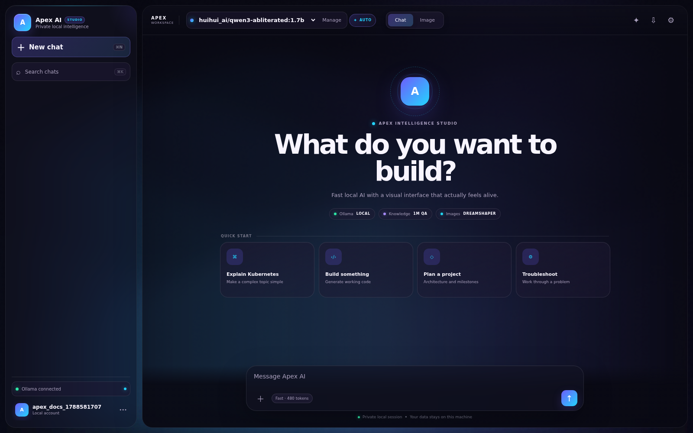
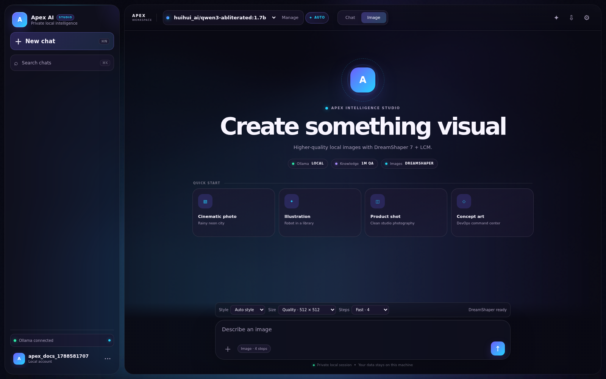
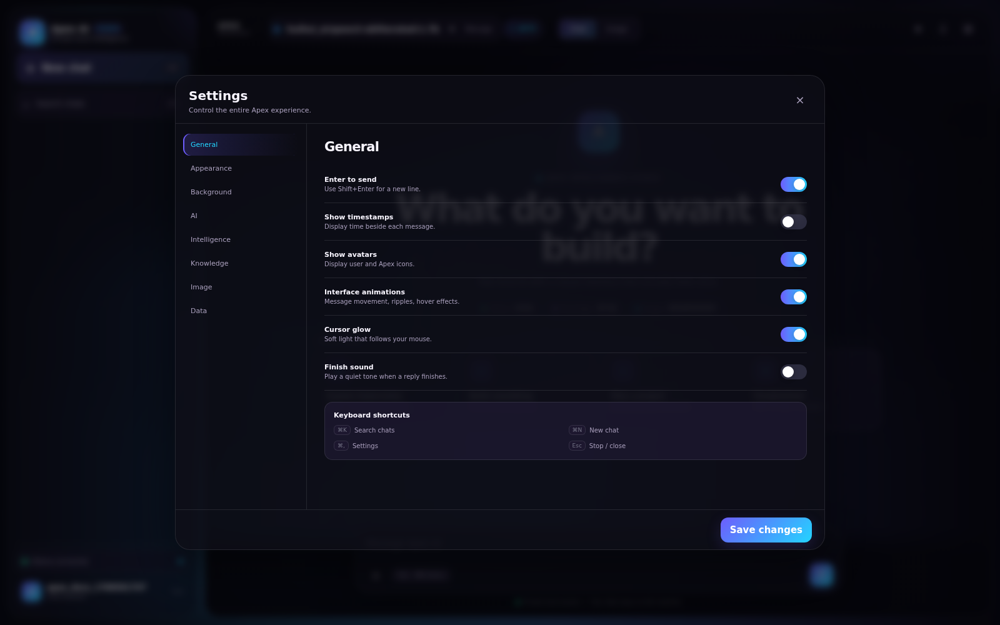
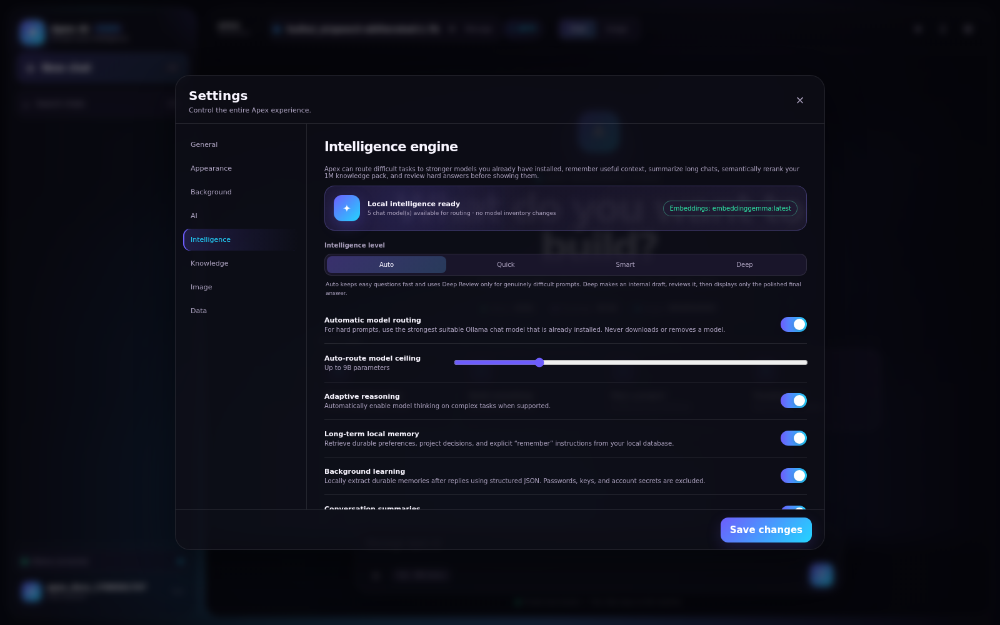
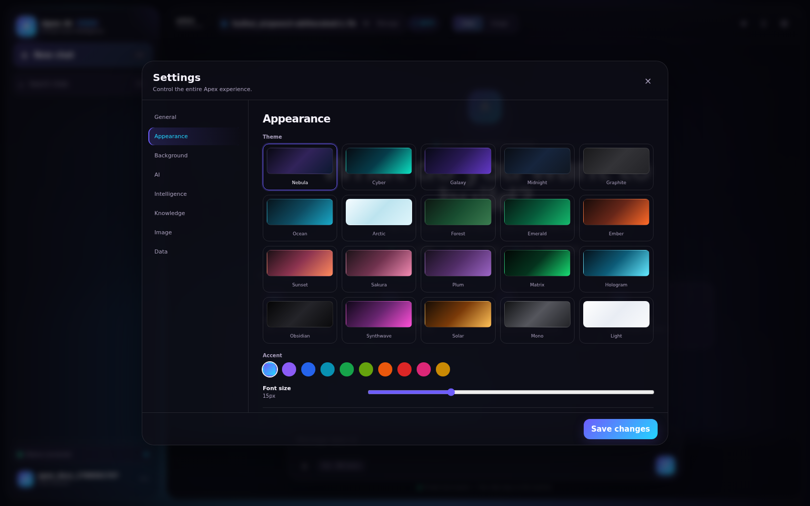
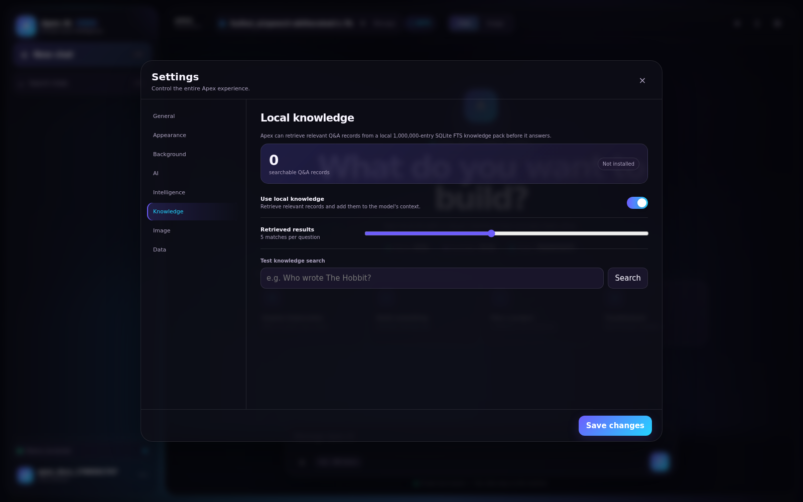
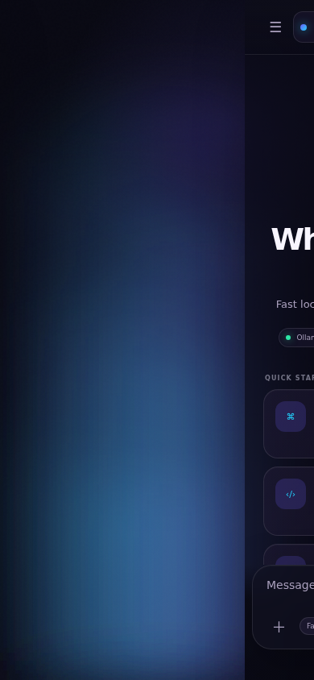
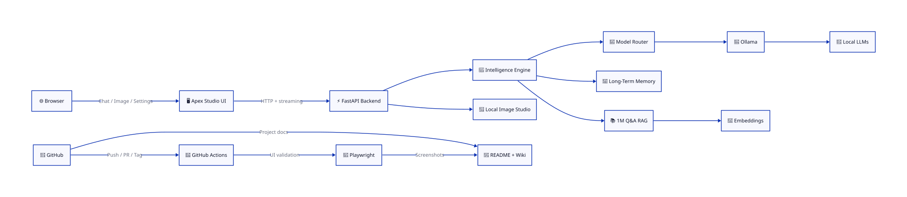

# ⚡ Apex AI

> **A local-first AI workspace powered by Ollama, FastAPI, adaptive intelligence, long-term memory, a 1,000,000-entry RAG knowledge layer, local image generation, Playwright automation, D2 architecture, and CI/CD.**

---

## ✨ What Apex AI Can Do

| Icon | Capability | Description |
|---|---|---|
| 🦙 | **Local LLMs** | Run locally installed Ollama models |
| 🧠 | **Adaptive Intelligence** | Auto, Quick, Smart and Deep modes |
| 🧭 | **Model Routing** | Route harder prompts to stronger installed models |
| 💾 | **Long-Term Memory** | Store and retrieve useful information locally |
| 📚 | **1M Knowledge Layer** | Search a million-entry local Q&A database |
| 🔎 | **RAG** | Retrieve relevant context before answering |
| 🧬 | **Semantic Retrieval** | Rerank knowledge with embedding models |
| 🎨 | **Image Studio** | Local prompt-to-image interface |
| 🌌 | **Animated UI** | Themes, motion, backgrounds and glass effects |
| 💬 | **Chat Management** | Search, pin, rename, edit, regenerate and export |
| 📱 | **Responsive UI** | Desktop and mobile interfaces |
| 🧪 | **Playwright** | Automated browser screenshots |
| 📐 | **D2** | Architecture as code |
| 🚀 | **CI/CD** | GitHub Actions validation and packaging |

---

# 📸 Playwright UI Tour

Every screenshot below was captured from the running Apex AI application by Playwright.

## 🔐 Login

## 🏠 Main Workspace

## 🎨 Image Studio

## ⚙️ Settings

## 🧠 Intelligence Engine

## 🌌 Themes & Appearance

## 📚 Knowledge & RAG

## 📱 Mobile Interface

---

# 📐 D2 Architecture

Editable D2 source:

**docs/architecture.d2**

---

# 🏷️ Technology

`AI` · `Artificial Intelligence` · `Ollama` · `Local AI` · `Local LLM` · `LLM` · `Generative AI` · `RAG` · `Long-Term Memory` · `Embeddings` · `FastAPI` · `Python` · `JavaScript` · `SQLite` · `Playwright` · `Image Generation` · `GitHub Actions` · `DevOps` · `CI/CD` · `D2` · `Local First`

---

# 🧪 Playwright Automation

Playwright documents:

- 🔐 Authentication
- 🏠 Main workspace
- 🎨 Image Studio
- ⚙️ Settings
- 🧠 Intelligence
- 🌌 Themes
- 📚 Knowledge and RAG
- 📱 Mobile interface

Capture fresh screenshots with:

    .playwright-venv/bin/python tools/apex_screenshots.py

The documentation capture does not submit an expensive image-generation request.

---

# 📚 Apex AI Wiki

Full documentation:

**docs/wiki/Home.md**

Wiki sections include:

- Overview
- Features
- Installation
- Architecture
- Intelligence
- Knowledge and RAG
- Image Studio
- Screenshots
- Development
- CI/CD
